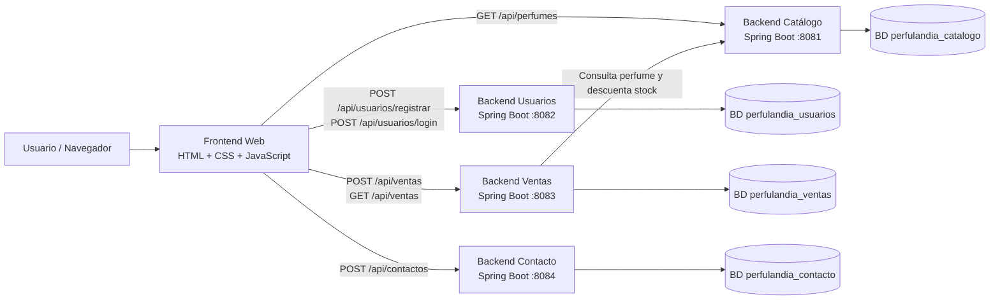

# Perfulandia SPA - Proyecto Fullstack 1

Perfulandia SPA es mi primer proyecto Fullstack, desarrollado como una aplicación web para una perfumería online. El sistema permite visualizar un catálogo de perfumes, registrar usuarios, iniciar sesión, realizar compras, descontar stock y enviar mensajes de contacto.

El proyecto fue construido separando responsabilidades entre frontend, backend, base de datos y pruebas, con el objetivo de aplicar de forma práctica los fundamentos de desarrollo Fullstack.

## Objetivo del proyecto

El objetivo principal es simular una tienda online de perfumes, donde el usuario pueda navegar por productos disponibles, registrarse, iniciar sesión y generar una compra. Además, el sistema cuenta con una sección de contacto para registrar mensajes enviados desde el sitio web.

Este proyecto busca demostrar el uso de:

- Frontend web con HTML, CSS, JavaScript y Bootstrap.
- Backend con Java y Spring Boot.
- Persistencia de datos con MySQL.
- Servicios separados por dominio funcional.
- Consumo de APIs REST desde el frontend.
- Documentación de endpoints con Swagger.
- Pruebas unitarias con JUnit, Mockito y H2.

## Tecnologías utilizadas

| Área | Tecnologías |
|---|---|
| Frontend | HTML5, CSS3, JavaScript, Bootstrap |
| Backend | Java 17, Spring Boot, Spring Web, Spring Data JPA |
| Seguridad | Spring Security, BCrypt Password Encoder |
| Base de datos | MySQL 8 |
| Contenedores | Docker, Docker Compose |
| Testing | JUnit 5, Mockito, Spring Boot Test, H2 |
| Documentación API | Swagger / Springdoc OpenAPI |
| Herramientas | Maven, VS Code, Live Server |

## Arquitectura general

El sistema está dividido en un frontend y cuatro backends Spring Boot. Cada backend tiene una responsabilidad específica y se conecta a su propia base de datos MySQL.



## Flujo principal de compra

1. El usuario ingresa al sitio web desde el navegador.
2. El frontend consulta el catálogo al backend de catálogo.
3. El usuario puede registrarse o iniciar sesión.
4. El usuario selecciona un perfume y realiza una compra.
5. El backend de ventas consulta el perfume al backend de catálogo.
6. Si hay stock disponible, se registra la venta.
7. El backend de ventas solicita al backend de catálogo descontar el stock.
8. El frontend actualiza el catálogo y la tabla de ventas registradas.

## Estructura del proyecto

```text
PerfulandiaSpa---Fullstack1-main/
├── backend/
│   ├── back-Catalogo_SpringBoot/
│   │   └── Servicio encargado del catálogo de perfumes y stock
│   ├── back-Usuarios_SpringBoot/
│   │   └── Servicio encargado de registro, login y usuarios
│   ├── back-Ventas_SpringBoot/
│   │   └── Servicio encargado de compras y ventas
│   └── back-Contacto_SpringBoot/
│       └── Servicio encargado de mensajes de contacto
├── database/
│   └── databases.sql
├── frontend/
│   ├── index.html
│   ├── styles.css
│   └── app.js
├── docker-compose.yml
└── README.md
```

## Servicios backend

| Servicio | Puerto | Responsabilidad | Base de datos |
|---|---:|---|---|
| Catálogo | 8081 | Gestiona perfumes, precios, imágenes, estado activo y stock | `perfulandia_catalogo` |
| Usuarios | 8082 | Registra usuarios, valida login y cifra contraseñas | `perfulandia_usuarios` |
| Ventas | 8083 | Registra compras, calcula totales y descuenta stock | `perfulandia_ventas` |
| Contacto | 8084 | Registra mensajes enviados desde el formulario de contacto | `perfulandia_contacto` |

## Funcionalidades principales

### Frontend

- Página principal con diseño de perfumería.
- Catálogo visual de productos.
- Formulario de registro de usuarios.
- Formulario de inicio de sesión.
- Formulario de compra.
- Tabla de ventas registradas.
- Formulario de contacto.
- Alertas visuales para acciones exitosas o errores.

### Backend Catálogo

- Listar perfumes disponibles.
- Buscar perfume por ID.
- Crear y actualizar perfumes.
- Eliminar perfumes.
- Descontar stock cuando se realiza una venta.
- Carga inicial de perfumes de ejemplo.

### Backend Usuarios

- Registrar usuario.
- Validar email duplicado.
- Encriptar contraseña con BCrypt.
- Iniciar sesión validando email y contraseña.
- Listar usuarios.
- Buscar usuario por ID.

### Backend Ventas

- Crear venta.
- Consultar información del perfume al backend de catálogo.
- Validar stock disponible.
- Calcular total de venta.
- Registrar estado de la venta.
- Listar ventas generales y ventas por usuario.

### Backend Contacto

- Registrar mensaje de contacto.
- Listar mensajes.
- Buscar mensaje por ID.
- Filtrar mensajes por estado.
- Marcar mensajes como revisados.

## Requisitos previos

Antes de ejecutar el proyecto, se recomienda tener instalado:

- Java 17.
- Docker Desktop.
- Navegador web.
- Visual Studio Code.
- Extensión Live Server para ejecutar el frontend.

No es obligatorio instalar Maven manualmente, porque cada backend incluye Maven Wrapper (`mvnw` y `mvnw.cmd`).

## Configuración de base de datos

El proyecto utiliza MySQL mediante Docker Compose.

Desde la raíz del proyecto, ejecutar:

```bash
docker compose up -d
```

Esto levanta un contenedor MySQL con:

```text
Host: localhost
Puerto: 3306
Usuario: root
Contraseña: admin
```

El archivo `database/databases.sql` crea las bases de datos necesarias:

```sql
perfulandia_catalogo
perfulandia_usuarios
perfulandia_ventas
perfulandia_contacto
```

## Ejecución del proyecto

### 1. Levantar MySQL

Desde la raíz del proyecto:

```bash
docker compose up -d
```

### 2. Ejecutar backend de catálogo

```bash
cd backend/back-Catalogo_SpringBoot
./mvnw spring-boot:run
```

En Windows CMD o PowerShell:

```bash
mvnw.cmd spring-boot:run
```

### 3. Ejecutar backend de usuarios

En otra terminal:

```bash
cd backend/back-Usuarios_SpringBoot
./mvnw spring-boot:run
```

### 4. Ejecutar backend de ventas

En otra terminal:

```bash
cd backend/back-Ventas_SpringBoot
./mvnw spring-boot:run
```

### 5. Ejecutar backend de contacto

En otra terminal:

```bash
cd backend/back-Contacto_SpringBoot
./mvnw spring-boot:run
```

### 6. Ejecutar frontend

Abrir el archivo:

```text
frontend/index.html
```

con Live Server desde Visual Studio Code.

## URLs principales

| Componente | URL |
|---|---|
| Frontend | `http://127.0.0.1:5500/frontend/index.html` |
| Backend Catálogo | `http://localhost:8081` |
| Backend Usuarios | `http://localhost:8082` |
| Backend Ventas | `http://localhost:8083` |
| Backend Contacto | `http://localhost:8084` |

La URL exacta del frontend puede variar dependiendo de cómo Live Server abra la carpeta.

## Documentación Swagger

Cada backend cuenta con documentación Swagger para revisar y probar sus endpoints.

| Servicio | Swagger |
|---|---|
| Catálogo | `http://localhost:8081/swagger-ui/index.html` |
| Usuarios | `http://localhost:8082/swagger-ui/index.html` |
| Ventas | `http://localhost:8083/swagger-ui/index.html` |
| Contacto | `http://localhost:8084/swagger-ui/index.html` |

## Endpoints principales

### Catálogo

| Método | Endpoint | Descripción |
|---|---|---|
| GET | `/api/perfumes` | Lista los perfumes disponibles |
| GET | `/api/perfumes/{id}` | Busca un perfume por ID |
| POST | `/api/perfumes` | Crea un perfume |
| PUT | `/api/perfumes/{id}` | Actualiza un perfume |
| DELETE | `/api/perfumes/{id}` | Elimina un perfume |
| PUT | `/api/perfumes/{id}/stock/descontar?cantidad=1` | Descuenta stock |

### Usuarios

| Método | Endpoint | Descripción |
|---|---|---|
| GET | `/api/usuarios` | Lista usuarios registrados |
| GET | `/api/usuarios/{id}` | Busca usuario por ID |
| POST | `/api/usuarios/registrar` | Registra un nuevo usuario |
| POST | `/api/usuarios/login` | Inicia sesión |

### Ventas

| Método | Endpoint | Descripción |
|---|---|---|
| GET | `/api/ventas` | Lista ventas registradas |
| GET | `/api/ventas/{id}` | Busca venta por ID |
| GET | `/api/ventas/usuario/{usuarioId}` | Lista ventas de un usuario |
| POST | `/api/ventas` | Crea una nueva venta |

### Contacto

| Método | Endpoint | Descripción |
|---|---|---|
| GET | `/api/contactos` | Lista mensajes de contacto |
| GET | `/api/contactos/{id}` | Busca mensaje por ID |
| GET | `/api/contactos/estado/{estado}` | Filtra mensajes por estado |
| POST | `/api/contactos` | Registra un mensaje |
| PUT | `/api/contactos/{id}/revisado` | Marca un mensaje como revisado |

## Pruebas automatizadas

El proyecto incluye pruebas unitarias en los servicios principales del backend. Estas pruebas ayudan a comprobar que la lógica de negocio funcione correctamente sin depender directamente de MySQL, ya que en ambiente de test se utiliza H2 como base de datos temporal.

Pruebas agregadas:

```text
back-Catalogo_SpringBoot/src/test/java/.../PerfumeServiceTest.java
back-Usuarios_SpringBoot/src/test/java/.../UsuarioServiceTest.java
back-Ventas_SpringBoot/src/test/java/.../VentaServiceTest.java
back-Contacto_SpringBoot/src/test/java/.../MensajeContactoServiceTest.java
```

Para ejecutar los tests, entrar a cada backend y ejecutar:

```bash
./mvnw test
```

En Windows CMD o PowerShell:

```bash
mvnw.cmd test
```

Ejemplo:

```bash
cd backend/back-Catalogo_SpringBoot
./mvnw test
```

## Decisiones importantes del proyecto

- Se separó el backend por dominios funcionales para mantener el código ordenado.
- Cada servicio tiene su propia base de datos, evitando mezclar información de catálogo, usuarios, ventas y contacto.
- El frontend consume APIs REST usando `fetch` desde JavaScript.
- El backend de ventas se comunica con el backend de catálogo para validar productos y descontar stock.
- Se utilizó Spring Security en usuarios para cifrar contraseñas con BCrypt.
- Se agregó Swagger para facilitar la revisión y prueba de endpoints.
- Se agregaron pruebas unitarias para validar reglas principales del sistema.

## Estado actual del proyecto

El proyecto actualmente permite:

- Visualizar perfumes cargados automáticamente.
- Registrar usuarios.
- Iniciar sesión.
- Comprar perfumes.
- Descontar stock después de una compra.
- Registrar y visualizar ventas.
- Enviar mensajes de contacto.
- Revisar endpoints mediante Swagger.
- Ejecutar pruebas unitarias en los servicios backend.

## Posibles mejoras futuras

- Agregar autenticación con token JWT.
- Proteger endpoints según rol de usuario.
- Crear un panel de administración para perfumes, usuarios, ventas y mensajes.
- Agregar carrito de compras.
- Mejorar validaciones con anotaciones como `@NotBlank`, `@Email` y `@Min`.
- Agregar tests de integración para controladores REST.
- Dockerizar también los backends y el frontend.
- Agregar pipeline de integración continua con GitHub Actions.

## Autor

Proyecto desarrollado por Gubier Zamora como primer proyecto Fullstack académico.
